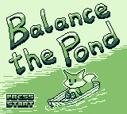

# Balance the Pond

Ein Fuchs (Foxo), der sich ein neues Zuhause sucht und dort die Balance wiederherstellen will.

This game was made for the [Hetzner Game Jam 2025](https://gamejam.hetzner.com/) in 48 hours.

Thanks to [Hetzner](https://www.hetzner.com) and [Hochschule Ansbach](https://www.hs-ansbach.de) for providing the jam site.

## Play

[Play in browser](https://balancethepond.grueb.org/)
or
Download the project and GB Studio to run the game.

## License

## Credits

see [CREDITS.md](CREDITS.md)
